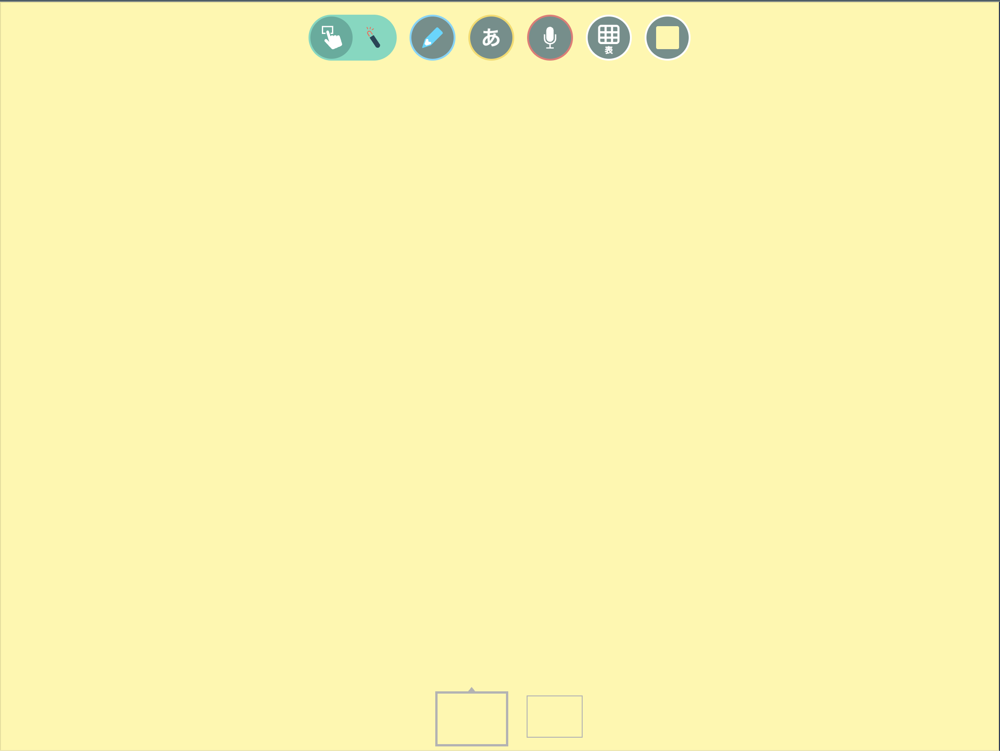
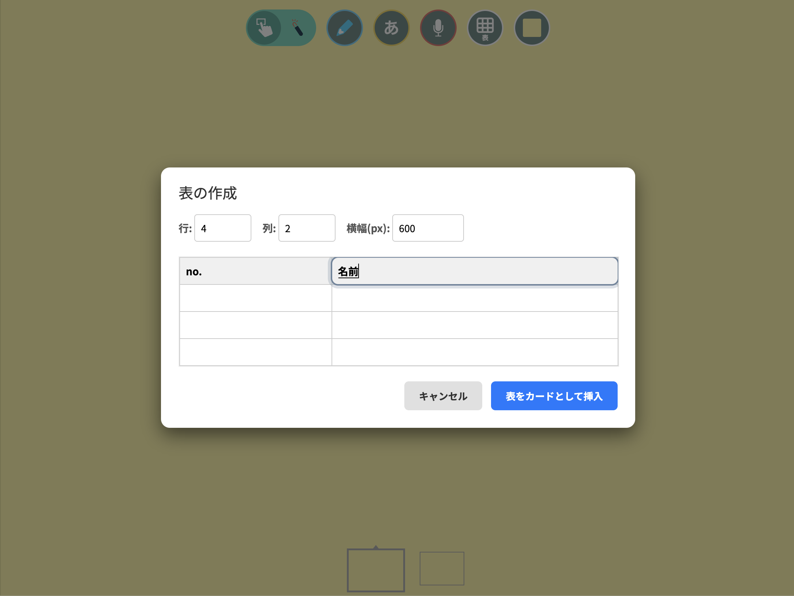
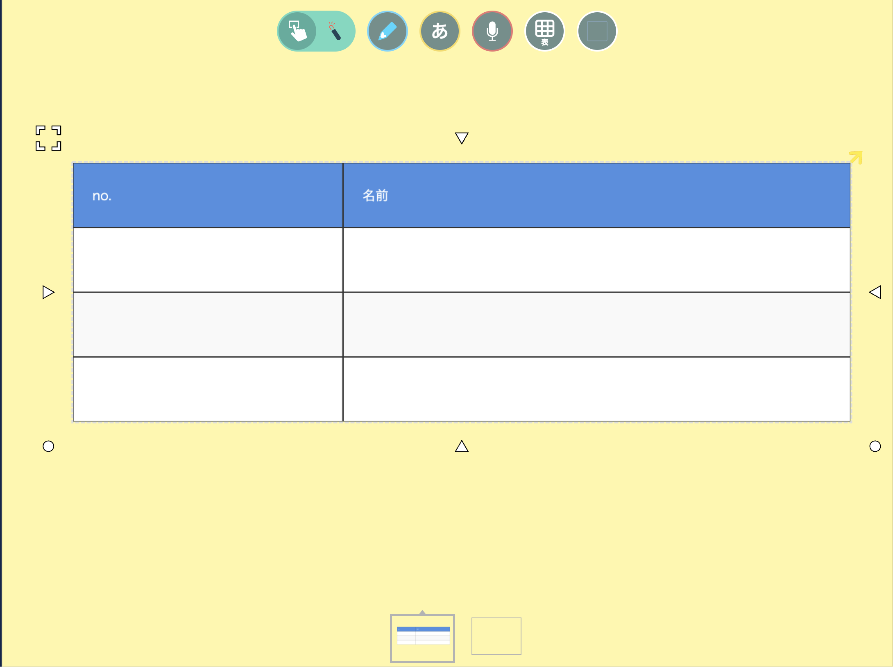

# LoiLo Table

ロイロノート・スクールに「表機能」を追加するChrome拡張機能です。

## 拡張機能の目的
ロイロノートには標準で表を作成する機能がありません。この拡張機能を利用することで、行数・列数を自由に指定した表を素早く作成し、カードとしてロイロノートのノート上に挿入することができます。

## 主な機能
- **直感的な表作成**: 行数、列数、横幅を指定して表を作成できます。
- **カードとして挿入**: 作成した表をそのままロイロノートのカードとして挿入可能です。
- **データ入力**: 表の作成画面で事前にテキストを入力しておくことができます。

## 利用方法

### 1. 拡張機能の起動
ロイロノートの画面上部に表示される「表」アイコンをクリックします。

### 2. 表の構成と内容入力
表示されたダイアログで、必要な「行数」「列数」「横幅」を入力します。また、セルに直接テキストを入力することも可能です。

### 3. カードの挿入
「表をカードとして挿入」ボタンをクリックすると、現在のノートに表が配置されたカードが作成されます。

## インストール方法
1. このリポジトリをダウンロードまたはクローンします。
2. Google Chromeで `chrome://extensions/` を開きます。
3. 「デベロッパー モード」をオンにします。
4. 「パッケージ化されていない拡張機能を読み込む」を選択し、このプロジェクトのフォルダを選択します。

## 著作権

Hiroki Noguchi
